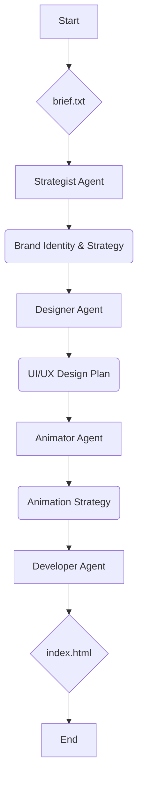

# Gemini Agent - Website Creator

This project uses a team of AI agents powered by `crewai` to automatically generate a personal portfolio website based on a simple text brief.

## File Structure

-   `.env`: Environment variables, including your API keys for the language models.
-   `main.py`: The main entry point to run the website generation crew.
-   `agents.py`: Defines the different AI agents in the crew (Strategist, Designer, Animator, Developer).
-   `tasks.py`: Defines the tasks that each agent performs.
-   `requirements.txt`: A list of the Python dependencies for this project.
-   `input/brief.txt`: The input file where you provide the brief for the website you want to create.
-   `output/index.html`: The generated website HTML file.

## Setup & Installation

1.  **Python:** Ensure you have Python 3.11 or higher installed.
2.  **Clone the repository (if you haven't already):**
    ```bash
    git clone <repository_url>
    ```
3.  **Create a virtual environment:**
    ```bash
    python -m venv .venv
    source .venv/bin/activate
    ```
4.  **Install dependencies:**
    ```bash
    pip install -r requirements.txt
    ```
5.  **Set up your environment variables:**
    Create a `.env` file in the `GeminiAgent` directory and add your API keys. For example:
    ```
    GEMINI_API_KEY=your_gemini_api_key
    ```

## How to Run

1.  **Provide the website brief:**
    Edit the `input/brief.txt` file to describe the website you want to create.

2.  **Run the script:**
    ```bash
    python main.py
    ```

## Agent Workflow

The project follows a sequential process where each agent builds upon the work of the previous one.



## Output

The generated `index.html` file will be saved in the `output` directory. You can open this file in your web browser to see the final website.
